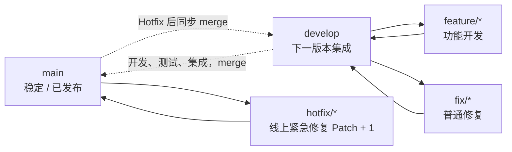
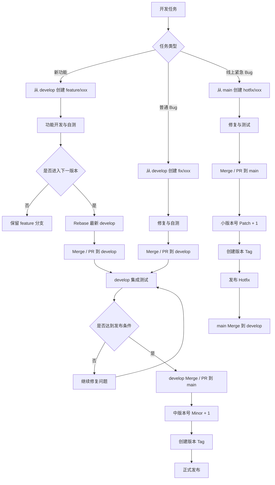

## 总体规则

```text title="rules.txt"
版本：
Major.Minor.Patch
大版本号-新功能迭代版本号-补丁修复版本号

长期分支：
main                  已发布稳定版本
develop               下一发布版本

临时分支：
feature/<name>        独立功能
fix/<name>            下一版本普通修复
hotfix/<name>         当前线上紧急修复

核心原则：

feature 完成 ≠ 必须进入 develop
feature 确定本期上线 → 才进入 develop

main    = 已发布
develop = 下一次发布
feature = 尚未集成的独立功能
tag     = 实际发布版本

已经被多人依赖的公共分支禁止 rebase
个人独占分支可以 rebase
```

分支间的关系：



## SOP 流程

### Feature 功能开发

1. 从 `develop` 创建 `feature/xxx` 分支。
2. 在 `feature/xxx` 完成功能开发和自测。
3. 开发期间需要同步最新代码时，将 `feature/xxx` Rebase 到最新 `develop`。
4. 功能完成，并确定进入下一版本后，将 `feature/xxx` Merge / PR 到 `develop`。
5. 本期不上线的功能不合入 `develop`，继续保留 feature 分支。
6. 功能合入并验证完成后，删除 `feature/xxx`。

### 正常版本迭代

1. 本期计划上线的 feature、fix 全部合入 `develop`。
2. 在 `develop` 完成功能联调、集成测试和回归测试。
3. 进入发布阶段后停止加入新的 Feature，只处理发布前问题。
4. 确认达到发布条件后，将 `develop` Merge / PR 到 `main`。
5. Minor + 1，例如 `4.1.0 → 4.2.0`。
6. 在 `main` 对应发布提交打 Tag，例如 `v4.2.0`。
7. 基于 `main` 构建正式版本并发布。

### 普通 Bug 修复

1. 从 `develop` 创建 `fix/xxx`。
2. 完成问题修复和测试。
3. 需要同步最新 `develop` 时，可以 Rebase。
4. 修复完成后 Merge / PR 到 `develop`。
5. 跟随下一正常版本一起发布。
6. 完成后删除 `fix/xxx`。

### 线上 Hotfix

1. 从 `main` 创建 `hotfix/xxx`。
2. 完成线上问题修复和测试。
3. 将 `hotfix/xxx` Merge / PR 到 `main`。
4. Patch + 1，例如 `4.2.0 → 4.2.1`。
5. 在 `main` 对应提交打 Tag，例如 `v4.2.1`。
6. 基于 `main` 构建并发布 Hotfix 版本。
7. 将最新 `main` Merge 到 `develop`，确保后续版本包含该修复。
8. 删除 `hotfix/xxx`。

### Rebase / Merge 原则

1. `main`、`develop` 是公共分支，禁止 Rebase 和 Force Push。
2. 个人独占的 feature、fix、hotfix 分支可以 Rebase。
3. 个人分支即使已经 Push，只要没有其他人依赖，也可以 Rebase。
4. Rebase 后需要更新远端时使用 `--force-with-lease`，避免直接使用 `--force`。
5. 一旦分支已经被多人依赖，就视为公共历史，禁止 Rebase。
6. feature、fix → `develop` 使用 Merge / PR。
7. `develop` → `main` 使用 Merge / PR。
8. hotfix → `main`，随后 `main` → `develop`。

### 版本号规则

采用 `Major.Minor.Patch`：

- **Major**：重大版本升级，例如 `4.0.0 → 5.0.0`。
- **Minor**：正常功能版本迭代，例如 `4.1.0 → 4.2.0`。
- **Patch**：线上 Hotfix，例如 `4.2.0 → 4.2.1`。

分支职责：

| 分支 | 职责 |
| --- | --- |
| `main` | 已经发布或达到正式发布条件的稳定代码 |
| `develop` | 下一次准备发布的集成代码 |
| `feature/xxx` | 独立功能开发 |
| `fix/xxx` | 跟随下一版本发布的普通 Bug 修复 |
| `hotfix/xxx` | 当前线上版本的紧急修复 |
| Tag | 标记实际发布过的版本 |

## 基本操作流程

覆盖三类任务：新功能（包括准备上线和未来上线）、普通 Bug、线上紧急 Bug。


