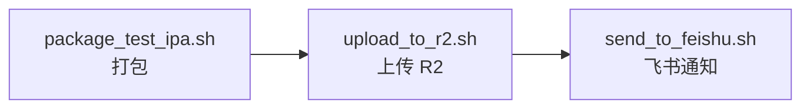

使用 scripts 自动发布 iOS 测试包，实现「一键打包 → 上传 → 飞书通知」。

## 1. package_test_ipa.sh

- 使用 `xcodebuild` 归档并导出 Debug 测试 IPA。
- 生成 OTA 安装所需的 `manifest.plist`。
- 生成安装二维码和 `index.html` 安装页面。
- 产物保存到 `build/package`。

## 2. upload_to_r2.sh

- 将 IPA、`manifest.plist` 和安装页上传到 Cloudflare R2 固定路径。

## 3. send_to_feishu.sh

- 读取版本信息，将云端安装页地址发送到飞书群机器人。

## 4. release_test.sh

- 串联以上三个步骤，实现「一键打包 → 上传 → 飞书通知」。
- 任一步失败都会立即停止后续流程。

## 小结

这是一个 iOS 测试包的自动打包、OTA 分发和通知脚本集合。
