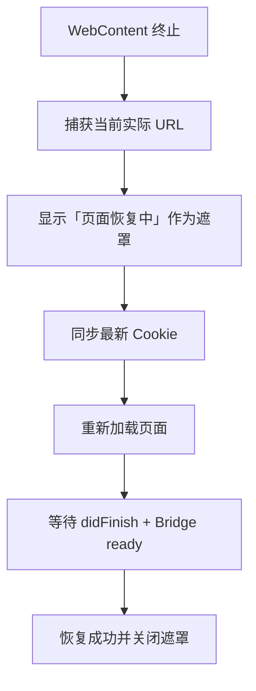

## 背景

WebView Content Process 是一个独立进程，收到了 `webContentProcessTerminate`，被终止后 WebView 停在空白页。

## 问题

WKWebView 本身没有被销毁，而是其独立的 WebContent 渲染进程被系统终止。

表现为：

- `/home`、`/mine`、`/promotion` 可能同时收到 `web_process_terminated`。
- 原生页面和 WKWebView 对象仍存在，但 H5 内容变成持续白屏。
- H5 JavaScript 已停止运行，无法通过 JS 错误捕获。
- `401` / `token_invalid` 属于登录态问题，可能影响页面数据，但不是 WebContent 进程终止的直接原因。
- 原来的简单 `reload()` 缺少 Cookie 同步、超时处理和失败兜底，不能保证恢复。

## 已实施的解决方案

提供一个断网刷新页作为遮罩，在 `BaseWebView` 中统一处理：

### 捕获与恢复

- 通过 `webViewWebContentProcessDidTerminate(_:)` 捕获原生终止事件。
- 使用当前实际 URL 恢复，避免错误地回到首页。
- 加载前重新同步登录 Cookie。
- 最多自动尝试两次：
  - 第一次使用正常缓存策略。
  - 第二次忽略本地缓存。
- 每次恢复超时为 8 秒。

### 成功判定

- 页面收到 `didFinish`。
- 原页面使用 Bridge 时，还必须重新收到 `action=ready`。

### 失败兜底

- 两次失败后显示「页面加载失败」和「重试」按钮。
- 用户点击重试后重新同步 Cookie，并重新执行两轮恢复。
- 恢复状态统一在主线程异步发布，避免 SwiftUI 状态更新断言。

### 日志与调试

- 增加完整恢复日志：
  - `web_recovery_started`
  - `web_recovery_attempt_started`
  - `web_recovery_cookie_synced`
  - `web_recovery_succeeded`
  - `web_recovery_failed`
- Debug 环境在所有使用 `managedWebView` 的页面增加悬浮终止按钮，可以直接测试 Home、Mine、Promotion。
- Debug 私有测试代码不会进入 Release。

## 当前覆盖范围

能够解决大多数情况：

- App 前台时 WebContent 被终止。
- App 返回前台过程中收到终止通知。
- 页面加载失败或缓存异常。
- Cookie 需要重新注入。
- 恢复最终失败时避免持续白屏。

<Callout type="warn">
暂未专门处理的低概率场景：

- 恢复刚开始，App 就进入后台并长时间挂起。
- 8 秒超时跨越后台挂起时间。
</Callout>
