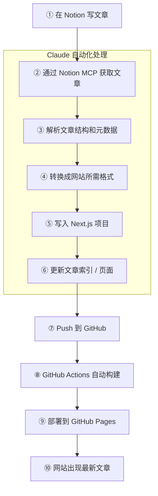

Notion 管内容，Next.js 管前端展示，中间由 Claude 来连接。

网站架构：`Next.js + TypeScript + MDX + GitHub Actions + GitHub Pages`

## 写作流程

1. 写文章
2. 告诉 Claude 发布哪一篇或哪一些
3. 网站自动更新

```text
Notion
   ↓ MCP
Claude
   ↓
Next.js
   ↓ Git Push
GitHub
   ↓ Actions
Build
   ↓
GitHub Pages
   ↓
Website
```

这样就能借助 Notion 强大的文档编辑能力，把想法沉淀成文档；经过修改定稿之后，告诉 Claude 写文档并且自动发布到网站。这样，写文章的人就能持续优化文档、持续发布。



## 后续扩展

- **GitHub** = 硬盘 / Source of Truth
- **Notion** = CMS / 内容源
- **Claude / Codex** = 开发者
- **Cloud Sandbox** = 开发电脑（后续可扩展优化，让服务读取 Notion、抄写文章、发布，完全放在云端）
- **GitHub Actions** = DevOps
- **GitHub Pages** = Web Server

### 可升级架构

```text
Notion
   │
   │ Notion MCP
   ▼
Claude Code Web
   │
   ├── Cloud Sandbox
   │     ├── GitHub Repo
   │     ├── Node.js
   │     ├── npm / pnpm
   │     └── Next.js
   │
   │ 修改文章格式 / build 检查
   ▼
GitHub
   │
   ▼
GitHub Actions
   │
   ▼
GitHub Pages
```

### 本地 vs 云端

```text title="现有本地架构"
Mac
├── Claude Code
├── Notion MCP
├── git clone xxx
├── Next.js
└── npm
```

```text title="目标升级架构"
Claude Cloud Sandbox
├── Claude Code
├── Notion MCP
├── git clone xxx
├── Next.js
└── npm
```
