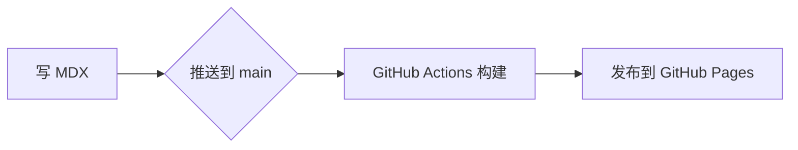

组件在 `components/mdx/Markdown.tsx` 中注册，注册后在任何 MDX 文件里都能直接使用。

## Callout

```mdx
<Callout>默认是提示信息。</Callout>
<Callout type="tip">小技巧。</Callout>
<Callout type="warn">需要注意的地方。</Callout>
```

<Callout>默认是提示信息。</Callout>
<Callout type="tip">小技巧。</Callout>
<Callout type="warn">需要注意的地方。</Callout>

## Kbd

```mdx
按 <Kbd>⌘</Kbd> <Kbd>K</Kbd> 打开搜索。
```

按 <Kbd>⌘</Kbd> <Kbd>K</Kbd> 打开搜索。

## 代码高亮

普通的代码块会自动高亮，支持 Swift、TypeScript、Python、Shell 等常见语言，浅色 / 深色模式各一套配色。

可以给代码块加标题，或者高亮某几行：

````md
```swift title="RootView.swift" {2-3}
enum Route: Hashable {
    case detail(id: String)
    case settings
}
```
````

效果：

```swift title="RootView.swift" {2-3}
enum Route: Hashable {
    case detail(id: String)
    case settings
}
```

## Mermaid 流程图

把代码块的语言写成 `mermaid`，页面上会渲染成图，支持流程图、时序图、状态图等。

````md

````

效果：


<Callout type="tip">
  流程图在浏览器里渲染，只有包含流程图的页面才会加载 Mermaid。语法参考 [Mermaid 文档](https://mermaid.js.org/intro/)。
</Callout>

## 新增组件

1. 在 `components/mdx/` 下写组件
2. 在 `Markdown.tsx` 的 `components` 对象里注册
3. 在 MDX 里直接使用
